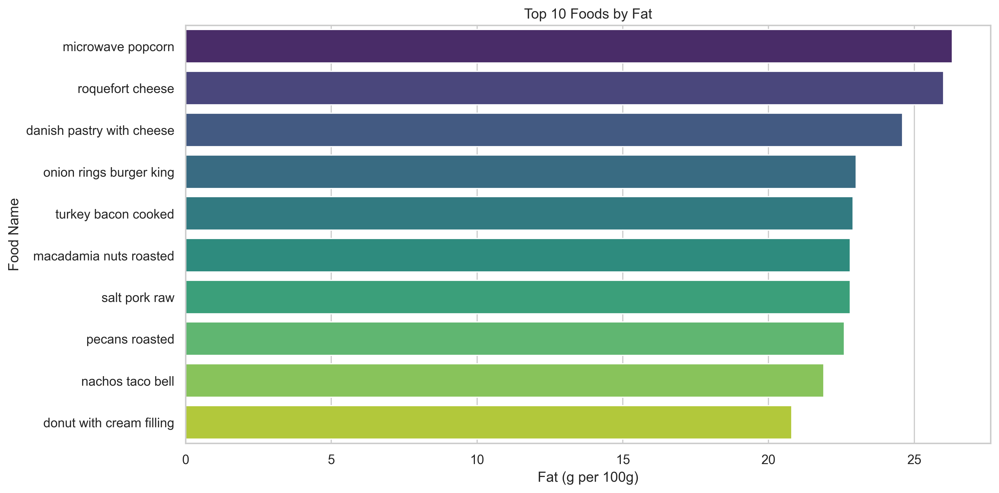
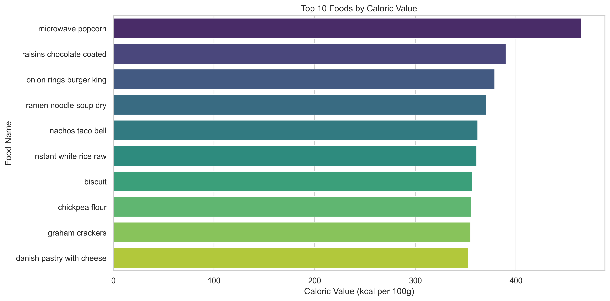
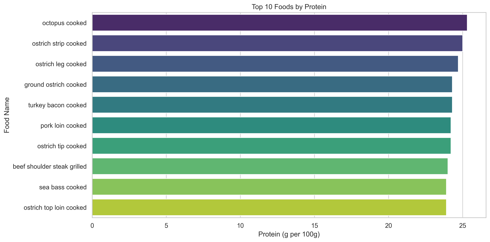
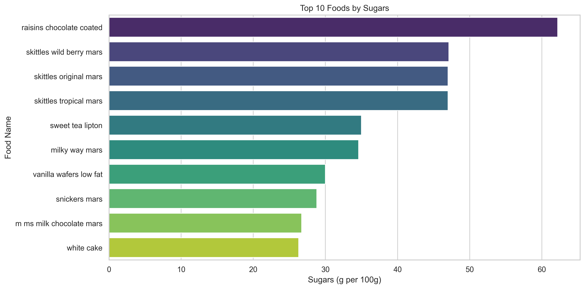

## Milestone 1 (20th March, 5pm)

### Dataset

For this project, we use the Food Nutrition Dataset available on Kaggle: https://www.kaggle.com/datasets/utsavdey1410/food-nutrition-dataset

This dataset contains nutritional information for a wide range of food items, including calories, macronutrients (proteins, fats, carbohydrates), as well as several vitamins and minerals. Each food is described through multiple numerical features, usually expressed per 100g, which makes comparisons between foods straightforward.
However, some preprocessing is still required:
-  standardizing units,
-  reducing the number of variables to keep the most relevant ones for visualization.
  
Overall, the dataset is rich and suitable for multi-dimensional analysis, but needs moderate cleaning and feature selection to avoid overly complex visualizations.

### Problematic

Choosing what to eat is not as simple as it seems. Each food combines many nutritional components (calories, fats, sugars, proteins) and understanding how they interact is often confusing. Most tools present this information in static ways, without adapting to individual needs.

The main idea of our project is to create an interactive visualization that adapts to the user. Instead of exploring food data in a generic way, users will be able to input their own context:
-  dietary restrictions (e.g., gluten-free, low sugar, vegetarian),
-  and personal information such as weight, height, sex, and activity level (or directly a target calorie intake).

Based on this, the system will compute personalized nutritional requirements, including caloric needs and macronutrient targets. It will then suggest suitable food options and recommended portions, ensuring that both nutritional goals and dietary constraints are respected.

The visualization will allow users to explore these recommendations interactively, compare foods, and understand why some options are more appropriate than others. This makes the experience more intuitive and tailored, rather than relying on fixed meal plans.

Our motivation comes from the difficulty of translating general nutritional guidelines into concrete, personalized choices. By combining user input with interactive visualization, we aim to make this process more accessible and informative.

The target audience includes students, young adults, and anyone interested in better understanding their diet or managing specific constraints.

### Exploratory Data Analysis
Our exploratory data analysis is available on our Git repository, under milestone_1/food_results.ipynb. 

Our dataset originally consists of five separate files, each containing identical nutritional features but different food items. These datasets were merged into a single dataset for subsequent analysis, resulting in a total of 2'395 food items. 
The dataset includes a wide range of variables describing both macro- and micronutrients, such as caloric value, fats (and their subtypes), carbohydrates, proteins, vitamins, and minerals.

Some nutritional components are more relevant for this project than others, as they correspond to what people are typically most interested in, namely caloric value, protein, fats, and sugars. Focusing on these variables, we plotted the top 10 foods with the highest values for each, resulting in the four graphs shown below.

### Related work

This dataset has already seen extensive use in a variety of projects. Some efforts focus on meal planning, generating daily or weekly plans for users, while others employ content-based recommendation systems that suggest recipes similar to those a user already prefers. Predictive health modeling has also been explored, using food and nutrition data to estimate health outcomes. More advanced applications include image-to-recipe models, which take a photo of a dish and return matching recipes with nutrition information, ingredients and instructions. Another project is an AI-powered meal planners, integrating Gemini 2.0, further personalize plans based on user preferences, fitness goals, target nutrients, and dietary restrictions (e.g., keto, halal, vegan). Other work includes BMI-based meal plan generator and nutrition prediction models, like those estimating sugar content in foods. 

What makes our approach original is that, unlike typical meal planners, it focuses on individual foods rather than pre-set meals. It highlights nutritional information interactively, allowing users to explore and compare foods in detail. With dynamic visualizations, users can gain a comprehensive view of their diet, understand how each food contributes to their overall nutrition, and directly compare multiple items. Our project also clearly incorporates dietary restrictions and substitutions, making it easy to adapt meals to personal needs. By combining personalized nutrition, flexible substitutions, and interactive visualizations, our system gives users complete control over meal composition and a deeper understanding of their food choices.

Our main objective is to present food and nutritional information in a clear, insightful, and visually engaging way through a variety of interactive visualizations. A key tool will be polar charts, which allow users to quickly see the macro- and micronutrient composition of each food item. These charts will also support comparisons between two food items, making nutritional differences immediately visible. In addition, a pie chart will illustrate the composition of recommended plate based on an individual's profile, showing the proportions of different food groups, such as proteins, carbohydrates, and vegetables in a simple and intuitive manner. 

Additional visualizations will include parallel coordinates diagrams to provide an overview of all food items, and network diagrams to highlight foods with similar nutritional profiles. Polar area charts will allow users to compare multiple foods at a glance, with longer arms representing higher nutrient values such as calories, fiber, or sugar. 

To refine our approach and enhance our visualizations, we draw inspiration from various sources:

- BiteKit: Offers visual food comparisons and a TDEE calculator, as well as a comprehensive nutrition database, serving as a reference for functionality and user experience.
- Observable NotHotDog Nutrition Visualizer: Demonstrates effective polar chart visualizations and comparison of nutrients relative to daily values.
- Data visualization resources: Websites like Data Viz Catalogue and Data Viz Project provide examples of visualization techniques, helping us select the most effective ways to represent our nutritional data.

These references guide our design choices, ensuring a rich and intuitive visual representation of food items and their nutritional properties, allowing users to explore, compare, and make informed dietary decisions on a single, accessible platform.

